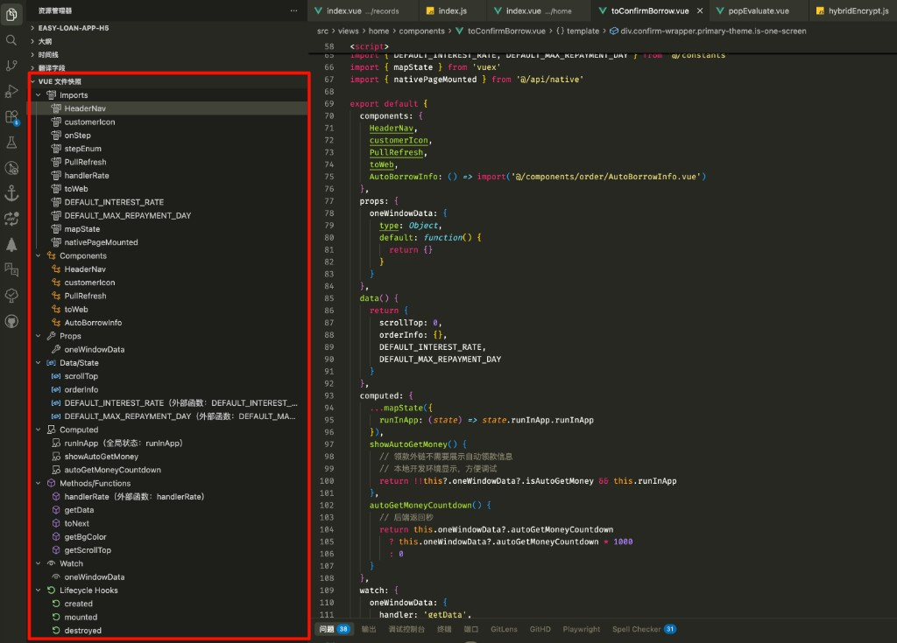

# Vue File Analyzer

在侧边栏 **「vue 文件快照」** 中展示当前 `.vue` 文件的结构，支持 Vue 2 Options API 与 Vue 3 Composition API（含 `<script setup>`）。点击节点可跳转到定义；切换文件或保存时自动刷新。



## 功能

- **Imports** / **Components** / **Props** / **Emits**
- **Data/State** / **Computed** / **Methods/Functions** / **Watch**
- **Lifecycle Hooks** / **Provide/Inject**

来源标识：map 辅助函数（如 `mapState`）显示「全局状态」等；来自 import 的引用显示「外部函数」。

## 开发

```bash
npm install
npm run compile
```

F5 启动扩展开发主机，打开 `.vue` 文件，在左侧资源管理器底部查看「vue 文件快照」。

## 技术栈

VSCode Extension API · @vue/compiler-sfc · @babel/parser + @babel/traverse · TypeScript
